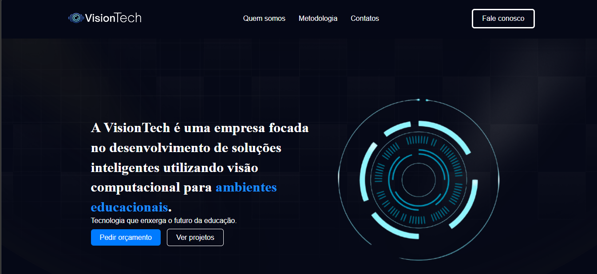
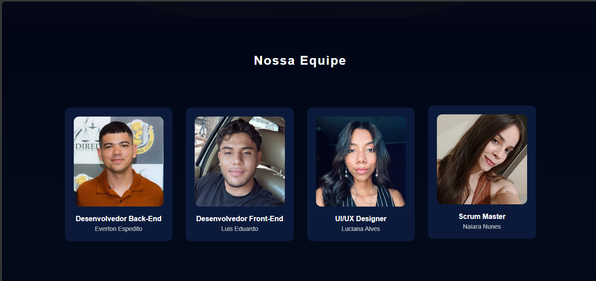
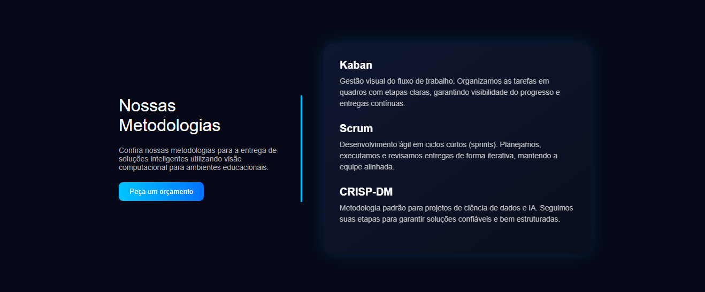
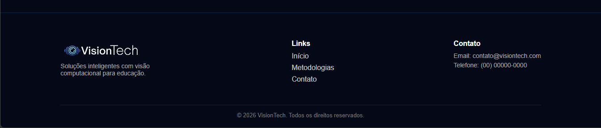

# 🚀 VisionTech

Landing page desenvolvida para apresentar a empresa **VisionTech**, focada em soluções inteligentes utilizando **visão computacional aplicada à educação**.

---

## 📌 Sobre o Projeto

Este projeto consiste em uma página web institucional com o objetivo de apresentar:

- Quem somos
- Serviços oferecidos
- Metodologias utilizadas
- Equipe de desenvolvimento

A proposta é transmitir uma identidade moderna, tecnológica e acessível.

## 🎨 Layout

O design segue um estilo:

- 🔵 Detalhes em azul (tecnologia/inovação)
- ✨ Interface moderna e responsiva

---

## 🛠️ Tecnologias Utilizadas

- HTML5
- CSS3
## 🖥️ Preview do Projeto

### Link para visualizar o projeto:  

